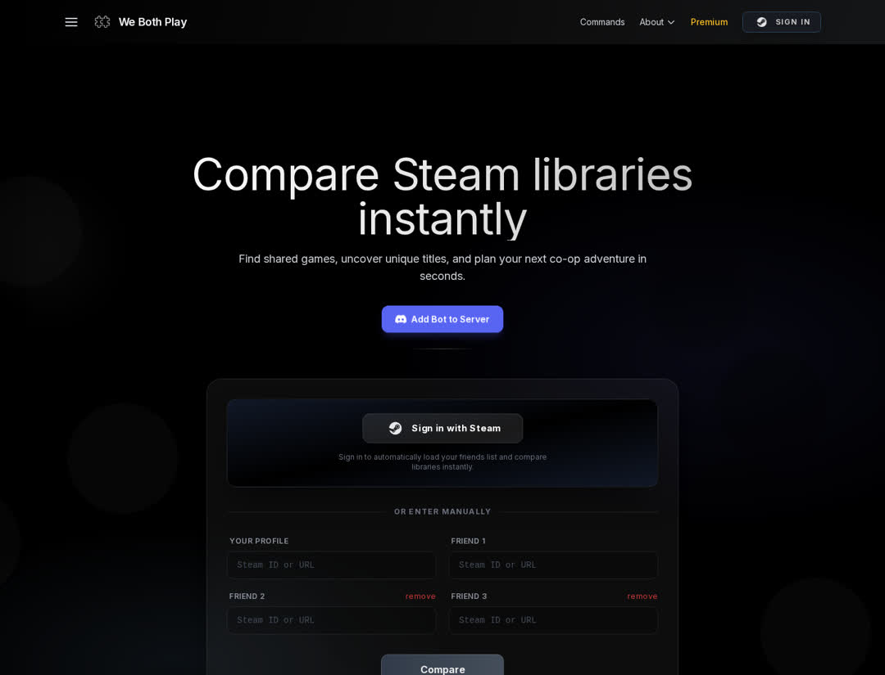
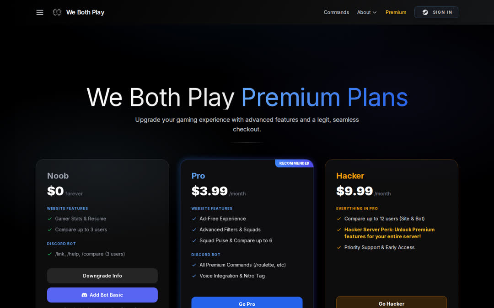
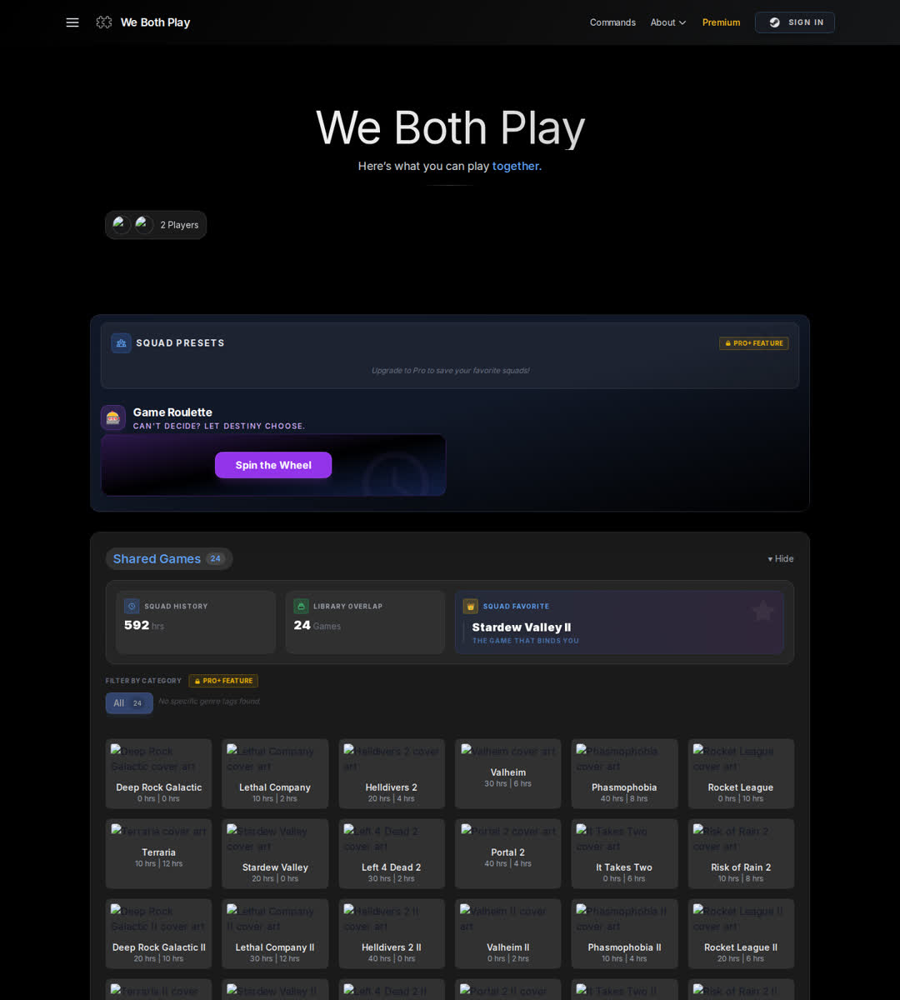

# Current-state audit (before the retrofit)

**Audited:** 2026-10-03, commit `8eb616d` ("fixed some widgets") on `main`.
**How:** full read of the repository (~12k lines of app code, the Discord bot and scripts), a production build, and the app running locally against a local Postgres. The live site (`webothplay.com`) was **not reachable** from the build environment, so behaviour that depends on production data, Steam's live API or Vercel configuration was not observed. Severity: **Critical** (exploitable or revenue-breaking now) · **High** · **Medium** · **Low**.

## 1. Architecture

| Area | State |
|---|---|
| Framework | Next.js 16.1.6 (App Router, Turbopack), React 19.2.4, plain JavaScript, Tailwind 3.4, Framer Motion, Sass (one file) |
| Pages | `/` (980-line client component doing landing + results), `/[id]` profile dashboard (1,288-line client component with draggable widgets), `/profile/[id]` (a second, older profile page), `/upgrade`, `/upgrade/claim`, `/dashboard`, `/auth/discord`, `/commands`, `/blog`, `/about`, `/privacy`, `/terms`, `/contact` |
| API | 30 route handlers: compare, game details, backlog, activity, Steam OpenID start/callback, friends, profile, collections, premium checks, Stripe checkout/portal/webhook, Ko-fi webhook/claim/short codes, Discord link endpoints, rankings, flex, a GIF proxy, **3 public debug routes** |
| Data | Postgres (Supabase, US-East) via `pg`; **no schema or migrations in the repo** — tables created by ad-hoc scripts. Tables: `users` (identity, plan, Stripe ids, Discord id, profile customisation), `user_collections`, `kofi_transactions`, `stripe_transactions`, `pending_upgrades` |
| Steam | Direct `fetch` to the Steam Web API in each route; no timeouts, retries or shared caching; store `appdetails` fetched per game on every comparison |
| Billing | Stripe Checkout (subscriptions, two tiers via env price IDs), Customer Portal, webhook; Ko-fi as a legacy path |
| Discord bot | `bot/` (discord.js 14) run separately with pm2; calls the website API; **`bot/node_modules` committed (3,420 files)** |
| Analytics | Google Analytics only; no product events |
| Monitoring | None (console logs only); no health check, no alerts, no cron |
| Tests / CI / lint | **None.** `npm run lint` called `next lint`, which Next 16 removed |
| Deployment | Vercel (README); `next.config.js` and `next.config.ts` both present (both empty) |

## 2. Security — the most urgent findings

| # | Severity | Finding | Evidence |
|---|---|---|---|
| S1 | **Critical** | **The production database password and a Steam Web API key are committed to a public GitHub repository** (and in git history). | Database connection string with password in 16 one-off scripts committed Feb 15–22, 2026 (first: `setup_db.js`; also `check_db_users.js`, `migrate_stripe.js`, `scripts/migrate_users.js`, `scripts/add_dashboard_layout.js` …). Steam key as a hard-coded fallback in `audit_library.js`, `debug_friend.js`, `resolve_vanity.js`. Repo visibility: public (verified via the GitHub API). |
| S2 | **Critical** | **No server-side authentication.** "Signed in" was a SteamID kept in `sessionStorage`, and visiting `/?steamid=<anyone>` set it. Every API trusted a `steamid` from the request body or query. Anyone could edit any profile, delete any collection, open **another user's Stripe billing portal** (cancel their plan, see invoices), link someone's Premium account to their own Discord, or start checkout as someone else. | `src/app/page.jsx:51-104`, `SiteHeader.jsx:13-38`, `api/user/profile` POST, `api/portal`, `api/discord/link` POST, `api/user/collections` |
| S3 | **Critical** | **Premium takeover chain.** `/api/user/profile` returned `SELECT *` (Stripe customer id, subscription id, **Ko-fi transaction id**, Discord id). `/api/claim-premium` granted Premium to any SteamID for any known transaction id, repeatedly. | `api/user/profile/route.js`, `api/claim-premium/route.js` |
| S4 | **High** | **Stored XSS in the Steam login callback**: the Steam display name was embedded in an inline ``. The OpenID assertion's `return_to`, `op_endpoint` and claimed-id host were not validated (replay of assertions minted for other sites). | `api/compare/auth/steam/callback/route.js` |
| S5 | **High** | **Ko-fi webhook accepted unauthenticated requests** when `KOFI_WEBHOOK_VERIFICATION_TOKEN` was unset → anyone could POST a fake payment and grant Premium. | `api/webhooks/kofi/route.js` |
| S6 | High | Public debug endpoints exposed schema details and wrote test rows. | `api/debug/*` |
| S7 | Medium | GIF proxy followed redirects and `og:image` URLs to any host and relayed any content type (SSRF-ish; could serve SVG/HTML from the site's origin). | `api/gif-proxy/route.js` |
| S8 | Medium | Private collections returned to anyone; vanity resolution matched **display names** (not unique) → comparisons could silently use the wrong person; users could set their own `vanity_id` to hijack someone else's custom URL. | `api/user/collections`, `api/compare` `resolveSteamID`, profile POST |
| S9 | Medium | No rate limiting anywhere (the compare endpoint spends Steam API quota: 100k calls/day). | all routes |
| S10 | Low | No security headers; `X-Powered-By` exposed. | — |

## 3. Billing & monetization

| # | Severity | Finding |
|---|---|---|
| B1 | **Critical** | **Stripe webhook incompatible with the pinned API version** (`stripe@20.3.1` → `2026-01-28.clover`): it read `subscription.current_period_end` (moved to subscription items) and `invoice.subscription` (moved under `invoice.parent`). `new Date(undefined * 1000)` → invalid date → DB error → 500 → buyers charged but not upgraded; renewals never extended. |
| B2 | High | "Downgrade to Pro" for Hacker users created **a second subscription** (double billing); plan changes made in the portal kept the old tier (tier read from checkout metadata only). |
| B3 | High | No webhook idempotency; no handling of failed payments; no alerting. |
| B4 | Medium | Inconsistent limits: form allowed 4 free players, API allowed 3; marketing said "up to 10"; tier names in the form (`Bronze/Silver/Gold`) didn't exist anywhere else; Ko-fi tier names other than Pro/Hacker silently granted nothing. |
| B5 | Medium | Category filters and saved squads were Premium-only — the core job (finding a co-op game) was paywalled while competitors are free. |
| B6 | Medium | AdSense loaded from a non-standard path (`/position/js/adsbygoogle.js`), no `ads.txt`, no consent mechanism; ads likely never served. |
| B7 | Medium | "Affiliate" CDKeys links had only UTM parameters (earned nothing), were labelled "BUY GIFT"/"FIND KEY" without disclosure, and pointed to a third-party key reseller. |

## 4. Product & UX

| # | Severity | Finding |
|---|---|---|
| P1 | High | The hero's primary button was **"Add Bot to Server"**, not comparing. The comparison form opened with "Sign in with Steam" and four manual inputs. |
| P2 | High | **One private profile failed the whole comparison** with a raw error; no guidance on the "Game details" setting. |
| P3 | High | **Wishlist features broken**: called Steam's removed `wishlistdata` endpoint (removed Nov 2024). |
| P4 | Medium | Results had no search, sort or density control; single-player games mixed in; "Only X" sections collapsed; hover-only "PLAY NOW" overlay (unusable on touch). |
| P5 | Medium | Backlog Slayer / Activity re-fetched every library through separate endpoints (3× Steam calls) and broke with custom URL inputs. |
| P6 | Medium | Store `appdetails` called for every shared game on every comparison with no cache (the store endpoint is rate-limited ≈200 req/5 min). |
| P7 | Medium | No shareable results URL (bot links used `/?steamid=a&steamid=b`, which also "logged in" the clicker as the first ID), no share card, no group decision tools beyond a 1.5 s random pick. |
| P8 | Low | `/[id]` catch-all rendered a profile dashboard for any path (no real 404s). |

## 5. Content, trust & SEO

- **Testimonials could not be verified** (names such as "Farted", "Legacy User… using this for months" on a site launched Feb 2026). Unverifiable reviews are risky under the FTC rule on fake reviews (16 CFR Part 465) and were removed.
- FAQ claimed "we never save your ID" while the app upserted every compared user into `users`; the privacy policy mentioned only Ko-fi (not Stripe, GA or cookies) and named no data-storage country (required by the Steam Web API terms).
- No "Powered by Steam" link (required by Steam's /dev page). Blog = two internal progress posts.
- Metadata: no `metadataBase` (OG image URLs resolved to localhost), OG image was the logo (626×520), no canonicals, sitemap with fake priorities, no structured data; the homepage was a client component that hid content until scroll-triggered animations ran.

## 6. Accessibility & performance

- White on `#3b82f6` buttons (3.68:1, fails AA); many 8–10 px labels; hover-only actions; modals without focus management; inputs without accessible error messages; decorative auto-playing animations on the landing page with no reduced-motion handling; full-page screenshot showed large empty regions until animations triggered.
- AdSense + GA loaded on every page; Framer Motion and react-grid-layout shipped to the landing page; ~980-line client component for the homepage (no static rendering of the hero).

## 7. Operations

- No health endpoint, no error tracking, no cron, no alerts, no owner reporting, no backups documented, no migrations, no tests, no CI, no lint; one-off debugging scripts at the repo root with hard-coded IDs and credentials; committed bot `node_modules`.

## What the retrofit changed

See [FINAL_REPORT.md](FINAL_REPORT.md). Every finding above is either fixed in code or listed in [NEEDS_FROM_OWNER.md](NEEDS_FROM_OWNER.md) (S1 requires the owner to rotate credentials — it cannot be fixed by deleting files, because the secrets are in public git history).
