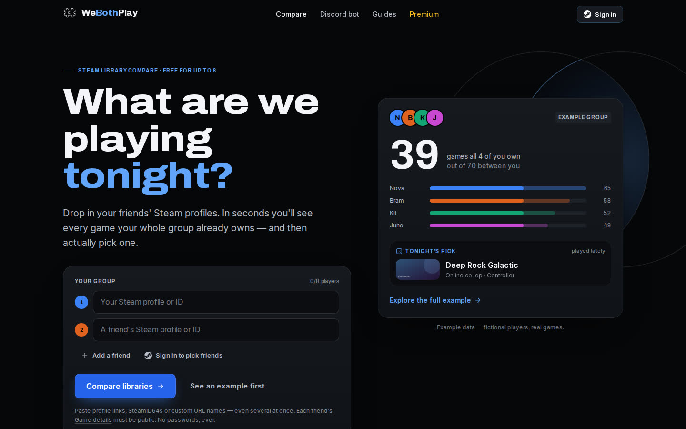

# WeBothPlay retrofit — final report

**Branch:** `claude/new-session-dudnen` (from `main` @ `8eb616d`) · **Date:** 2026-10-03
**Read first:** [NEEDS_FROM_OWNER.md](NEEDS_FROM_OWNER.md). Two leaked secrets must be rotated before anything else, and six short setup steps come before deploying.

---

## Executive summary

WeBothPlay was a working Steam-library comparer with a dark, recognisable look, but behind it:

- **Security:** no real authentication, so anyone could act as anyone, open their billing portal, take over Premium, or edit and delete their profile. The repository also carried production database credentials.
- **Billing:** the Stripe webhook didn't work with the pinned Stripe API version.
- **Free tier:** the free tier was worse than Steam's own built-in feature.
- **Operations:** no monitoring, tests or analytics.

The retrofit keeps the name, the near-black stage, the original blue, amber-for-Premium and the two-piece logo, and changes nearly everything underneath:

1. **Secure by default.** Signed server sessions via Steam OpenID with full assertion checks; every account, billing and Discord action is tied to the signed-in user; secrets are out of the code; there's rate limiting, security headers and a locked-down GIF proxy; debug routes are gone. The owner must still rotate the two leaked secrets.
2. **The tool is the hero, and deciding is the product.** The compare form is above the fold on every screen, with a live example beside it. Results live at shareable URLs and lead into decision tools: filters on Steam's own tags, "best for tonight", **roulette**, a **shortlist → group vote with one veto each**, "one copy away", fun facts, and **share cards**. A private profile no longer breaks the comparison.
3. **Fair Premium, working billing.** Free now covers 8 players and every filter. Premium sells bigger groups, saved groups and Discord extras. The Stripe webhook is rewritten: correct for API `2026-01-28.clover`, idempotent, order-independent and alerting, with no duplicate subscriptions possible. The ad and "affiliate" code that earned nothing was removed.
4. **Runs itself.**
   - First-party funnel analytics, an owner dashboard, and a Monday report in Discord.
   - A daily self-check that pings only when something is wrong.
   - A health endpoint, owner alerts and data retention.
   - CI with lint, unit/DB tests, build, 54 E2E runs (27 tests × 2 viewports) and accessibility scans.
5. **A growth engine.**
   - **Built into the product:** share and vote links with rendered preview cards; tagged bot links.
   - **Search:** six genuinely useful pages.
   - **TikTok:** a research-backed 13-week system with a JSON-driven 9:16 renderer in the site's design language. All 80 calendar posts render from it with one command (one sample per template and a contact sheet are committed), plus strategy, hooks, CTAs, style, shot lists, experiments and a weekly optimisation loop.

Scale: about 280 files changed (≈17k lines added, ≈9k removed, excluding the 3,420 committed `bot/node_modules` files, now untracked) across six phase commits.

## Research summary

Full evidence, with URLs, dates and Fact/Observation/Interpretation labels, is in [RESEARCH_BRIEF.md](RESEARCH_BRIEF.md) and its five detailed files. The ten conclusions that drove decisions:

1. **Showing shared games is a commodity; deciding is the gap.** Steam's client has done "games to play together" for chats of up to 8 since 2022, and 2026 entrants such as ReadyUp and Co-Op Now compete on voting and vetoes. → We built roulette, votes with vetoes, one-copy-away and share cards.
2. **Free must beat Steam itself.** → Free tier raised from 3 to 8 players, with all filters.
3. **Private "Game details" silently breaks results.** It's a separate setting from profile visibility. → Partial results, naming who's hidden, a copyable fix message and a guide.
4. **Steam removed the old wishlist endpoint (Nov 2024).** → Moved to `IWishlistService`.
5. **Steam has no player-count data.** → Filters use Steam's own category tags (including Remote Play Together); no invented player counts.
6. **Stripe API `2026-01-28.clover` moved `current_period_end` and `invoice.subscription`.** → Webhook rewritten.
7. **The ads and the "affiliate" links earned nothing** (wrong AdSense path, no affiliate ID). → Both removed; labelled affiliate links can be switched on later.
8. **TikTok: 2–5 posts a week captures most of the gain; at most 5 hashtags; business accounts use the Commercial Music Library.** → 4 posts/week baseline.
9. **Google dropped FAQ rich results (May 2026) and penalises scaled content.** → No FAQ schema and no per-game pages; a few real tool pages and guides.
10. **Steam Web API terms** (100k calls/day, name the storage country, "Powered by Steam" link) and **Discord's intent review at 10k users**. → Complied; the intent change is documented.

**Research limits:**
- The live site was blocked from the build environment.
- Reddit was unreadable, so no Reddit quotes were invented.
- The 200-search budget ran out, so Steam event dates and affiliate rates are marked unverified and gated.

## Product

| Problem before | Now |
|---|---|
| The hero's main button was "Add Bot to Server"; comparing needed four manual fields | **The form is the hero.** Paste several profile links at once, or sign in and tick friends; inline validation; saved and recent groups; a live example beside it |
| One private profile failed the whole comparison | **Partial results** with a banner naming who's hidden, a copyable message to send them, and a guide |
| A wall of covers; single-player games mixed in; hover-only actions | Search, "best for tonight" sort, Steam-tag filters (co-op, online co-op, couch/Remote Play, PvP, controller, free, unplayed, played lately) with counts, single-player hidden by default, grid/list, tabs (everyone owns · one copy away · nobody's played · only one owns · wishlists) |
| "So what do we play?" was left to the group chat | **Roulette** (≤1.1 s, skippable, respects filters) → **shortlist** → **vote link** (tap what you'd play, one veto each, live results, spin among the survivors) → `steam://run` launch |
| No way to share results | Shareable `/compare?p=…` URLs plus **`/s/<id>` share pages whose preview card shows the group's numbers and a fun fact**; vote links get their own cards |
| Wishlist features silently empty | Shared wishlist and gift ideas on Steam's current API |
| Free capped at 3 (the form said 4); filters paywalled | Free covers 8 players and everything above |

The end-to-end journey (land → add group → see overlap → narrow → decide → share → launch) is in [PRODUCT_OPPORTUNITIES.md](PRODUCT_OPPORTUNITIES.md), with 24 scored opportunities and the next three bets.

## Design

Full spec: [DESIGN_SYSTEM.md](DESIGN_SYSTEM.md). Research: [DESIGN_RESEARCH.md](DESIGN_RESEARCH.md).

- **Concept: "two libraries, one overlap."** Two thin rings with a lit lens: the brand device across the site, share cards, 404, OG images and TikTok. Glass, gradient text, extralight headlines and floating orbs are gone; depth comes from tone steps.
- **Colour:**
  - Same identity, accessible: near-black `#060708`, the original blue `#3b82f6` for signal, and `#2563eb` behind white text (5.2:1, up from 3.68:1, which failed).
  - Amber is reserved for Premium and blurple for Discord.
  - Text never dimmer than `#8a919d` (6.4:1).
  - Eight friend colours validated as a set for colour-blind separation.
- **Type** (all SIL OFL):
  - **Archivo**, variable width: expanded ExtraBold headlines and condensed caps labels at 12 px minimum.
  - **Inter**: UI text; covers Cyrillic and Greek Steam names.
  - **JetBrains Mono**: IDs.
  - Fluid clamp scale from 360 to 1440 px; tabular numbers for stats.
- **Motion:** 120–200 ms feedback. One signature moment: the roulette reel lands in 1.1 s and hands off to "Tonight's pick" through a View Transition, with a haptic tick on phones. `prefers-reduced-motion` is respected everywhere. No scroll-jacking or looping backgrounds.
- **Layout and responsive:** mobile-first, with a 16 px+ gutter and explicit single-column grids, so nothing overflows sideways (tested). The toolbar is sticky and wraps on phones. Touch targets are ≥44 px. Screenshots are in `screenshots/after-*`: desktop, tablet, mobile and 2560 px wide.

## Engineering

**Architecture:**
- Shared server modules in `src/lib`: session, OpenID, Steam client, comparison service, billing, plans, analytics, metrics, ops, shares, profiles.
- Thin route handlers, with server components for content pages.
- Route handlers return typed error codes, which the UI maps to helpful states.

**Security:**
- HMAC-signed HttpOnly sessions; every assertion and return URL is checked; `next` redirects are safe.
- Escaped output (the stored XSS is fixed); whitelisted profile columns; single-use, account-bound Ko-fi claims.
- The bot API needs a key; Discord link URLs are signed; Ko-fi fails closed without its token.
- The GIF proxy uses a host allowlist and doesn't follow redirects; rate limits; security headers; no `X-Powered-By`.
- Debug routes and root scripts holding secrets are deleted.

**Steam:**
- One client with timeouts, retries, a TTL cache and typed errors.
- Store metadata is cached in Postgres with a fetch budget, so `appdetails` is no longer called per game per comparison.
- Mock/demo mode (`STEAM_MOCK=1`) with real game titles for fictional players.
- Vanity names resolve only by exact custom URL, never by display name.

**Data:**
- Versioned, additive migrations (`npm run db:migrate`) with a tested rollback script.
- Compared friends are no longer written to the database.
- 13-month analytics retention.

**Billing:**
- Price-based tiers; the webhook is idempotent via `stripe_events` and order-independent.
- Failed-payment grace and alerts; existing subscribers are routed to the Customer Portal.

**Quality:**
- **ESLint:** Next 16 core-web-vitals config, clean. Real bugs fixed along the way: conditional hooks in two dashboard modals, missing alt text.
- **Unit tests:** 35, plus **7 DB integration tests** (run with `TEST_DATABASE_URL`).
- **E2E:** 27 Playwright tests × 2 viewports, including axe WCAG 2.2 A/AA scans of 9 pages, with no serious or critical violations.
- **CI:** a GitHub Actions workflow runs all of it on every pull request.
- **Types:** the project is plain JavaScript, so there is no type-check step. ESLint and tests cover it; `// @ts-check` per file is a cheap future option.

**Performance:** measured with Lighthouse 13 on the production build, local, mock mode, Steam images blocked. These are lab numbers, not field data.

| Page | Mobile before → after | Desktop after |
|---|---|---|
| Home | Perf 79 → **90**, LCP 5.6 → 3.6 s, CLS 0 | Perf 100, LCP 0.8 s |
| Results (example) | Perf 75 → **82**, LCP 6.8 → 4.2 s, CLS 0 | Perf 99, CLS 0.13 → 0 |
| Premium | Perf 54 → **94**, CLS 0.81 → **0** | Perf 100 |

Accessibility 100 and Best practices 100 on all three, mobile and desktop. SEO 100 except the results page, which is `noindex` on purpose. Fixes behind these numbers:
- Pricing is server-rendered.
- Only Latin fonts are preloaded (the other scripts load on demand).
- The 108 KB logo became a 3 KB one; proper favicons.
- The footer no longer jumps while results load.

## Monetization

Details: [MONETIZATION_AUDIT.md](MONETIZATION_AUDIT.md).

- **Packaging** (single source of truth: `src/lib/plans.js`):
  - **Noob:** free — 8 players, everything in the core, 3 saved groups.
  - **Pro:** $3.99/mo — 12 players, 50 saved groups, Premium bot commands, voice-channel compare, badge.
  - **Hacker:** $9.99/mo — 16 players, 200 saved groups, server perk.
  - Existing subscribers keep their price; their limits only went up. Annual plans appear automatically once annual Stripe Prices exist.
- **Billing robustness:**
  - Correct for the current Stripe API; idempotent; handles `paused`/`resumed`; failed payments get a 2-day grace on top of Stripe retries plus a "past due" notice with a fix link.
  - Plan switches go through the Portal; no duplicate subscriptions.
  - Alerts reach the owner's Discord; MRR is in the weekly report.
- **Ko-fi:** authenticated, single-use claims; a payment can only extend access.
- **No dark patterns.** Upsells appear only at a real limit, with no pop-ups or countdowns, renewal terms beside every paid button, and two-click cancellation.
- **Removed:** AdSense and the CDKeys links. **Optional:** Humble, GMG and Fanatical deep links, `rel="sponsored"` and disclosed, switched on by environment variables once you're approved. There's no Steam affiliate program.

## Growth

- **In-product loops:**
  - Every result has a **share link** with a rendered card ("39 games in common · Everyone owns Bloons TD 6. Nobody has launched it.").
  - Every shortlist becomes a **vote link** that the whole group opens.
  - Shared pages and votes carry a "compare your libraries" CTA.
  - Analytics measures the loop: shares → share views → link-entry comparisons (ANALYTICS.md, query H).
- **Discord:** bot links carry `utm_source=discord`; bot comparisons are counted separately; old `/?steamid=` links in Discord history redirect to the new results page. Next bet: public result cards with buttons, plus user-install.
- **Search:**
  - `metadataBase`, per-page canonicals, a real sitemap and robots, and `noindex` on per-user pages.
  - Article/Breadcrumb and Organization structured data.
  - Pages: 3 tool pages (`/roulette`, `/backlog`, `/coop`), 3 guides answering real queries (compare libraries; "game details" private; picking a game with friends), and an honest blog post. No FAQ schema, no scaled pages.
- **TikTok:** below.

## TikTok

Everything lives in `marketing/`:

| Asset | Where |
|---|---|
| 2026 research (cadence, hooks, length, music, safe zones, events, compliance) | `marketing/TIKTOK_RESEARCH_2026.md` |
| Strategy (audience, positioning, 11 pillars, 8 series, cadence, batching, cross-posting, KPIs) | `marketing/tiktok/CONTENT_STRATEGY.md` |
| 90 hooks · CTAs and UTM rules · visual style · shot/motion guide · 7 weekly experiments · weekly optimisation playbook | `HOOK_LIBRARY.md` · `CTA_LIBRARY.md` · `STYLE_GUIDE.md` · `SHOT_AND_MOTION_GUIDE.md` · `EXPERIMENT_PLAN.md` · `WEEKLY_OPTIMIZATION_PLAYBOOK.md` |
| **13-week calendar** (Oct 5 2026 → Jan 3 2027; the brief's 20 columns, including hook, voiceover, on-screen text, caption, hashtags, audio, assets and status) | `marketing/tiktok/90_DAY_CALENDAR.csv`, generated from `build-calendar.mjs` |
| **Renderer**: JSON → 1080×1920 MP4s, covers, carousel slides and overlays in the site's design system; 8 templates; safe zones; demo label | `marketing/renderer/` (`npm run social:render`) |
| Rendered assets | `npm run social:render` writes all 80 posts to `marketing/renders/out/` in about 20 minutes. The folder is gitignored, so run it on your machine. A sample per template and a contact sheet of every cover are committed in `marketing/renders/samples/` |

**Cadence:**
- **Baseline:** 4 posts/week (Mon/Wed/Fri/Sun; 48 videos + 4 carousels). Floor 3.
- **Extras:** 7/week only in confirmed event weeks; 18 reserve and 10 trend-slot rows let you post daily when something works.
- **Event-dated rows** stay *Blocked* until you verify the date on Steam's partner calendar.

**Templates follow the research timing:** motion from frame 1, payoff by about 3 s, quick hits at 9 s or longer, end card 1.8 s, with a slow drift during the hold so the frame never sits still.

**Rules built in:**
- Fictional groups are always labelled "Demo data · fictional friend group".
- Game names appear as text only, with no key art or Steam logo.
- At most 5 hashtags; Commercial Music Library audio.
- Claims about games are checked against bot gating (voice-channel `/compare` is Pro, so it's not promoted as free).
- **Never** bots, bought engagement or unofficial automation.

**Workflow:** TikTok's Content Posting API reportedly limits unaudited apps to private posts. This is unverified: TikTok's developer site was blocked here (research §3.9). So the honest automation is a **5-minute review-and-schedule** routine (SHOT_AND_MOTION_GUIDE §8):
1. `npm run social:calendar` (optional, after editing the bank).
2. `npm run social:render`.
3. Drop the overlay on your screen capture in CapCut and add Commercial Music Library audio.
4. Paste the caption and hashtags from the CSV.
5. Schedule in TikTok.

## Automation

What runs without you:

- **Vercel Cron, daily:** DB and Steam-key self-test, anomaly detection (comparisons dropping, Steam failures, error spikes), data retention.
- **Vercel Cron, weekly:** the Monday report to Discord.
- **Stripe and Ko-fi webhooks:** keep plans in sync, idempotently, including renewals, cancellations, plan switches and failed payments.
- **Store metadata:** cached and refreshed on demand within Steam's rate limits.
- **CI:** blocks broken pull requests (lint, tests, build, E2E, accessibility).
- **Social:** the calendar and renders regenerate from one data file.

## Monitoring

| You'll know because… | How |
|---|---|
| The site is down or misconfigured | `/api/health` turns 503 → your uptime monitor pings you (set one up: NEEDS_FROM_OWNER #7) |
| Something broke today | The daily check posts to Discord, and only when something's wrong |
| Payments are failing | Instant Discord alert on webhook errors; failed payments in the weekly report; Stripe's own emails |
| Steam is rejecting the key or rate-limiting | Instant Discord alert (throttled) |
| The funnel changed | Monday report flags ≥40% week-over-week swings; `/admin` shows where people drop |
| Errors in the browser or on the server | `client_error` and `server_error` events, counted in `/admin` and the report |

## Metrics

KPIs, all in `/admin` or the Monday report; queries in [ANALYTICS.md](ANALYTICS.md):

1. **Visitors → results**: the core health metric. Starting target: started → results ≥ 85%. If it's lower, check the "Why comparisons failed" panel.
2. **Results → shared or voted**: the viral loop. Target ≥ 10%. Also watch share views and link-entry comparisons.
3. **Weekly website comparisons** and **Discord bot comparisons** (reported separately).
4. **Decision-tool use per 100 results**: roulette, shortlist, votes (query G).
5. **New Premium · cancellations · failed payments · MRR**.
6. **Top sources** (UTM / referrer) and **TikTok** (logged weekly by hand): views, watch ratio, profile visits, bio-link visitors (`utm_source=tiktok`), and results from those visitors (query I).

Replace the starting targets with real baselines after 4 weeks of data.

## Credentials / owner actions

The complete list, in order, with time estimates, is in [NEEDS_FROM_OWNER.md](NEEDS_FROM_OWNER.md). The short version:

1. 🔴 **Rotate the leaked Supabase password and Steam API key** (public git history).
2. 🔴 **Set the new environment variables in Vercel:** `SESSION_SECRET`, `CRON_SECRET`, `ADMIN_STEAM_IDS`, `OWNER_ALERT_WEBHOOK_URL`, `BOT_API_KEY`, `DISCORD_LINK_SECRET`, plus the Ko-fi token or disabling Ko-fi.
3. 🔴 **Run `npm run db:migrate`** against production. It's additive; back up first.
4. 🔴 **Update the Stripe webhook** (API version and events), plus Portal and dunning settings.
5. 🔴 **Reinstall and redeploy the Discord bot** (`npm ci`, new `.env` values, deploy commands).
6. 🔴 **Merge and deploy**, then check `/api/health` and `/admin`.
7. 🟠 Within the first week: uptime monitor, permanent Discord invite, support email alias, Search Console, legal read-through of terms and privacy, tax decision, TikTok account and bio link, verify event dates.
8. 🟢 Optional: annual Prices, affiliate applications, Valve's sign-in button image, per-server plan, Discord user-install.

## Remaining risks

Things that could **not** be verified from this environment:

- **Live services weren't exercised.** The production site, real Steam Web API responses (including `IWishlistService` and store `appdetails` under load), real Stripe events, the Discord gateway and Vercel Cron were never called live. Everything ran against mocks, fixtures, a local Postgres and unit tests built on Stripe's typed shapes. Test after deploy, using the checklist in NEEDS_FROM_OWNER #6.
- **Leaked secrets are live until rotated.** Deleting the files doesn't remove them from public history.
- **Behaviour changes for existing users:**
  - `/<custom-url>` pages now exist only for members who have signed in; other paths 404. SteamID64 URLs always work.
  - Bot help and the Discord page now state that voice-channel `/compare` is Pro, which is what the bot already enforced.
  - Ko-fi claims grant 32 days per payment, like the webhook always did.
  - Users are signed out once, because the old client-side "login" was replaced.
- **Lab, not field, performance.** Lighthouse ran locally with Steam images blocked. Watch Vercel Speed Insights or Search Console's Core Web Vitals after launch.
- **Research gaps:** Steam event dates (gated in the calendar), affiliate commission rates, EU/UK VAT for a solo seller, and the exact wording of Valve's sign-in branding rules.
- **Legal:** `/terms` and `/privacy` were rewritten to match the code, but not by a lawyer.
- **Discord privileged intent:** the server perk relies on GuildMembers, which triggers Discord review at 10k users. The replacement is designed but not built.
- **TikTok creative results** are untested. The weekly playbook exists to replace assumptions with data from week 2.

## Next 30 days

| When | Priority | Measure |
|---|---|---|
| Days 1–2 | Owner actions 1–6 (rotate secrets, set environment variables, migrate, Stripe, bot, deploy). Run the post-deploy checklist; do one real purchase in test mode | `/api/health` ok; a test webhook shows 200; `/admin` shows events |
| Days 2–7 | Uptime monitor, Search Console + sitemap, permanent invite, support alias. Claim TikTok, set the UTM bio link, post weeks 1–2 of the baseline (4/week) | First Monday report arrives; `tiktok` appears in top sources |
| Week 2 | First weekly optimisation pass (WEEKLY_OPTIMIZATION_PLAYBOOK): double down / iterate / retire | Watch ratio and profile visits per post; bio-link visitors → results |
| Week 3 | Fix the biggest funnel drop that `/admin` shows (likely private profiles or invalid input). Consider annual Prices | Started → results ≥ 85% |
| Week 4 | Build **Discord public result cards + user-install** (highest-leverage loop), then batched Deck/review badges after a live endpoint check | Bot comparisons per week; share-loop query H |
| Day 30 | Replace starting targets with 4-week baselines; decide on the per-server Discord plan with real usage numbers | Baseline table in the ops-guide tracker |

---

*Owner's manual: [OWNER_OPERATIONS_GUIDE.md](OWNER_OPERATIONS_GUIDE.md): about 30 minutes a week for the site, plus about 4 hours a week for TikTok at the baseline cadence.*
